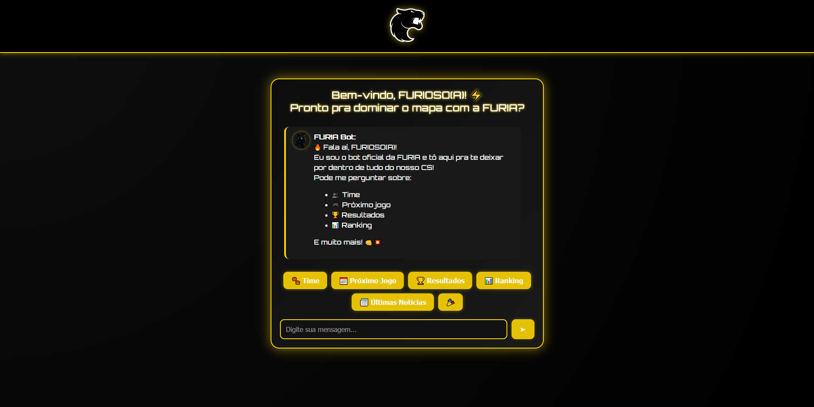

# 🐺 FURIA Chatbot – Desafio Técnico FURIA Tech

Este é um projeto de interface conversacional desenvolvido para o processo seletivo de Estágio/Assistente em Engenharia de Software da **FURIA Tech**.

O objetivo é criar um chatbot temático voltado aos fãs da FURIA, com informações úteis sobre o time, em uma interface personalizada com identidade visual gamer.

---

## 💡 Funcionalidades

- 🤖 Interface conversacional simulando um chat com a FURIA
- 🧠 Intents personalizadas para:
  - Próximos jogos
  - Últimos resultados
  - Elenco atual
  - Ranking
  - Torcida
  - Notícias (via RSS Feed)
- 💬 Botões com perguntas rápidas
- 👾 Avatares personalizados e visual gamer

---

## 📸 Captura de Tela



---

## 🚀 Como executar o projeto localmente

### 1. Clone o repositório

```bash
git clone https://github.com/seu-usuario/chatbot-furia.git
cd chatbot-furia
```

### 2. Instale as dependências

```bash
pip install -r requirements.txt
```

Se não houver no `requirements.txt`, instale manualmente:

```bash
pip install flask feedparser
```

### 3. Execute o servidor Flask

```bash
python app.py
```

### 5. Acesse o navegador

Abra: [http://127.0.0.1:5000](http://127.0.0.1:5000)

---

## 🛠 Estrutura do Projeto

```
.
├── app.py                 # Lógica principal do backend Flask
├── responses.py          # Intents e respostas personalizadas
├── templates/
│   └── chat.html         # Interface do chat (frontend)
├── static/
│   ├── style.css         # Estilos visuais personalizados
│   ├── script.js         # Lógica do chat no navegador
│   └── images/           # Logos, avatars, background
```

---

## 📚 Tecnologias Utilizadas

- Python 3.10
- Flask
- HTML + CSS + JavaScript
- Feedparser (leitura de RSS)
- Design customizado com imagens da FURIA

---

## 🤝 Agradecimentos

Projeto desenvolvido por **Guilherme Augusto Boquimpani**.  
Obrigado pela oportunidade! 👊
